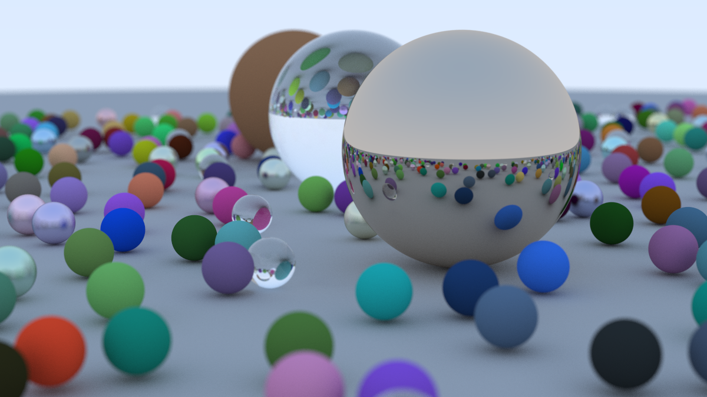

# Ray Tracer in C++

A physically-based CPU ray tracer built from scratch in C++, following [_Ray Tracing in One Weekend_](https://raytracing.github.io/books/RayTracingInOneWeekend.html) by Peter Shirley.



---

## What's Implemented

- PPM image output
- Vec3 math library (dot, cross, unit vector, reflect)
- Ray-sphere intersection
- Multiple objects via hittable list
- Antialiasing (multi-sample per pixel)
- Lambertian diffuse material
- Metal material with adjustable fuzz
- Dielectric (glass) material with Snell's law refraction
- Schlick reflectance approximation
- Positionable camera with vertical FOV
- Defocus blur / depth of field
- Final scene with 400+ randomly generated spheres

---

## Build & Run

**Requirements:** g++ (MinGW or GCC), Python + Pillow for image conversion

**Compile:**
```
g++ -O2 -o raytracer.exe main.cc
```

**Render:**
```
.\raytracer.exe | Out-File -Encoding ascii image.ppm
```

**Convert to PNG:**
```
python -c "from PIL import Image; img = Image.open('image.ppm'); img.save('image.png'); img.show()"
```

---

## Render Settings (Final Scene)

| Setting | Value |
|:--------|:------|
| Resolution | 1200 x 675 |
| Samples per pixel | 500 |
| Max ray depth | 50 |
| Camera FOV | 20° |
| Defocus angle | 0.6° |
| Focus distance | 10.0 |

---

## Project Structure

```
RayTracer/
├── main.cc           # Scene definition and entry point
├── camera.h          # Camera, rays, defocus blur, render loop
├── material.h        # Lambertian, Metal, Dielectric materials
├── sphere.h          # Sphere geometry and ray intersection
├── hittable.h        # Abstract hittable interface + hit_record
├── hittable_list.h   # List of hittable objects
├── ray.h             # Ray class
├── vec3.h            # 3D vector math
├── color.h           # Gamma correction and pixel output
└── image.png         # Final portfolio render
```

---

## Reference

Peter Shirley — [Ray Tracing in One Weekend](https://raytracing.github.io/books/RayTracingInOneWeekend.html)
